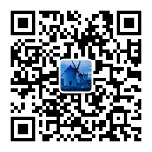

# 简介

微助手（WeHelper），是一款微信辅助工具APP。

## 特色
- 无需微信登录
- 不封号

## 简述
微助手作为一款微信辅助工具，提供一系列自动化操作，如检测僵尸粉，自动添加附近的人等功能，帮助用户高效快速的在微信上进行营销

## 联系方式
- 公众号

    微信搜索  **有名小栈** 关注，或者扫码关注

    

- 个人微信号

    微信搜索 **zsan606** 加好友，或者扫码

    
- 邮件 
    
    **<zsan605@gmail.com>**

    